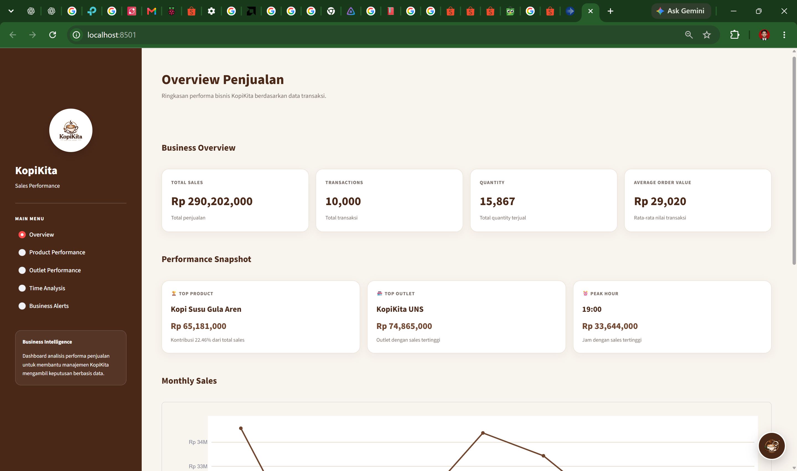
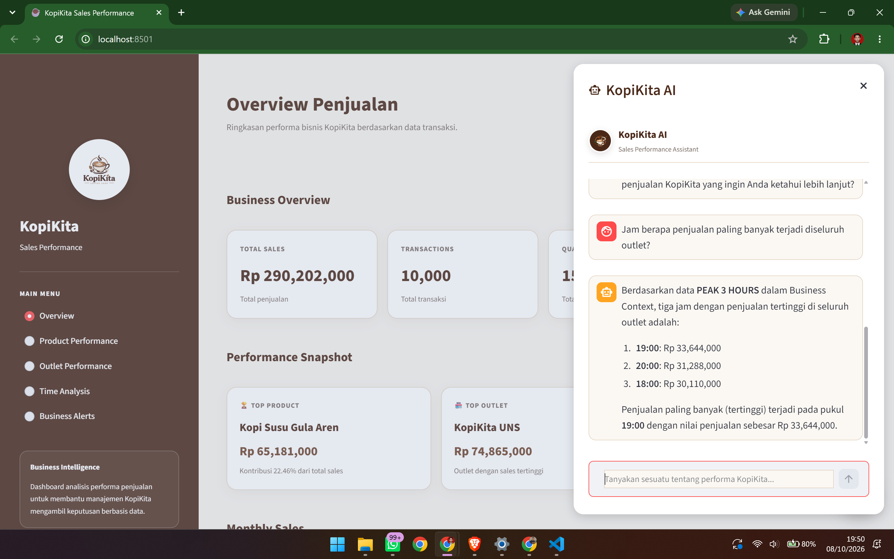
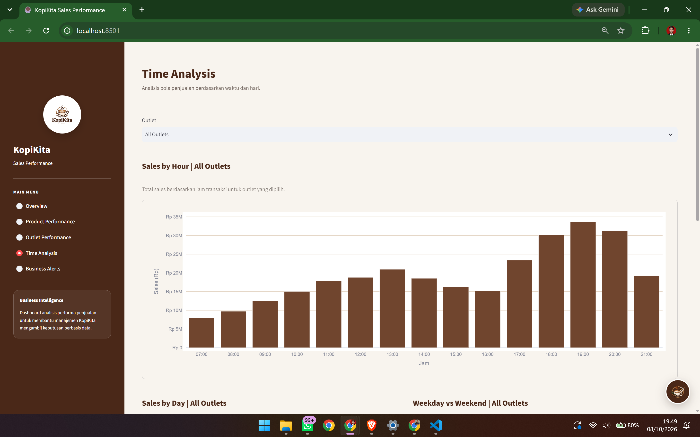

# KopiKita AI Sales Performance Assistant

> AI-powered sales performance dashboard and business assistant for KopiKita.

🚀 **Live Demo:** [Open KopiKita AI Sales Assistant](https://kopikita-sales-performance-assistant.streamlit.app/)

📂 **Source Code:** [GitHub Repository](https://github.com/key017/kopikita-sales-performance-assistant)
AI-powered sales performance dashboard and business intelligence assistant designed to help management understand sales performance through interactive analytics, business insights, alerts, and natural-language AI assistance.

---

## Overview

KopiKita AI Sales Performance Assistant is a business intelligence application that transforms transactional sales data into structured business information that can be easily understood by management.

The application combines:

- Sales performance analytics
- Interactive dashboards
- Product performance analysis
- Outlet performance analysis
- Time-based sales analysis
- Business alerts
- Structured business context
- AI-powered natural-language business analysis

The goal is to provide a single interface where management can monitor sales performance and ask business questions without manually analyzing raw transactional data.

---

## Project Preview

### Sales Performance Dashboard



### AI Sales Assistant



### Time Analysis



---

## Problem Statement

Raw transactional sales data can contain valuable business information, but analyzing thousands of transactions manually can be time-consuming and difficult for non-technical users.

This project addresses several common business analysis needs:

- Understanding overall sales performance
- Identifying high-performing products
- Comparing outlet performance
- Identifying peak sales periods
- Comparing weekday and weekend performance
- Identifying low-performing periods
- Generating business alerts from sales data
- Allowing management to ask questions using natural language

The system transforms raw transaction data into a management-oriented dashboard and AI-assisted business analysis interface.

---

## Key Features

### 1. Sales Performance Dashboard

The dashboard provides key performance indicators including:

- Total Sales
- Total Transactions
- Total Quantity
- Average Order Value (AOV)
- Average Selling Price (ASP)

---

### 2. Product Performance

The system analyzes product-level sales performance and provides:

- Top 5 products
- Product sales ranking
- Sales contribution
- Product performance comparison

Example:

- Kopi Susu Gula Aren
- Café Latte
- Americano
- Matcha Latte
- Cappuccino

---

### 3. Outlet Performance

The application compares sales performance between outlets.

Available analysis includes:

- Outlet sales
- Transaction count
- Sales contribution
- Outlet ranking

Example outlets in the dataset:

- KopiKita UNS
- KopiKita Klewer
- KopiKita Manahan
- KopiKita Solo

---

### 4. Time Analysis

The application provides time-based sales analysis including:

- Hourly sales performance
- Peak sales hours
- Day-of-week performance
- Weekday vs weekend comparison
- Monthly performance
- Outlet-specific time analysis

The Time Analysis section also provides an outlet selector so that users can analyze sales patterns for a specific outlet.

---

### 5. Business Alerts

The system automatically identifies important conditions that may require management attention.

Examples include:

- Monthly sales below the average
- High contribution from a specific product
- Peak sales periods

Business alerts are presented directly within the dashboard to help management identify important conditions quickly.

---

### 6. AI Sales Assistant

KopiKita AI allows users to interact with business data using natural-language questions.

Users can ask questions such as:

> What product should receive the most attention?

> Which outlet has the highest sales?

> When is the peak sales period?

> Which month has the lowest sales?

> How does weekday performance compare with weekend performance?

The AI assistant analyzes the structured business context generated by the application and provides management-oriented answers.

---

## AI Reasoning Approach

The AI assistant does not receive raw transaction data directly for every question.

Instead, the application first processes the sales data and generates a structured **Business Context**.

The workflow is:

```text
Raw Sales Data
      │
      ▼
Data Processing
      │
      ▼
Sales Analysis
      │
      ├── General KPI
      ├── Product Performance
      ├── Outlet Performance
      ├── Category Performance
      ├── Time Analysis
      ├── Day Performance
      └── Monthly Performance
      │
      ▼
Business Context
      │
      ▼
AI Sales Assistant
      │
      ▼
Business Answer
